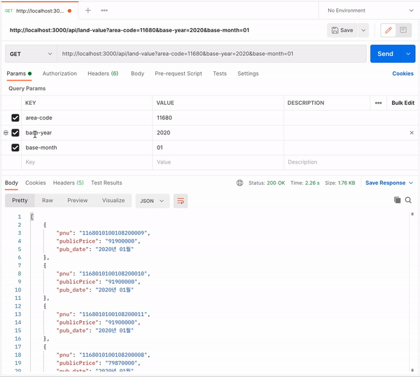
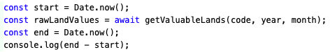

# 공간의 가치 백엔드 과제
## 🔎 개요

**서울시 구별 공시지가 순위**를 조회하는 API 서버입니다. 아래 URI를 통해 해당 지역의 **상위 20개 (공시지가 내림차순, pnu 올림차순)** 항목을 조회할 수 있습니다.  
`http://localhost:3000/api/land-value?area-code={시군구코드}&base-year={기준연도}&base-month={기준월}`

💾 공시지가 Database의 Dump 파일은 구글드라이브에서 받을 수 있습니다. [[받으러 가기]](https://drive.google.com/file/d/15ve-PGHfM8JEwGps9wm8ayknGyu0EdVT/view?usp=sharing)

⚠️ 공시지가 순위를 계산할 때, 기준은 2020년 1월입니다. 따라서 클라이언트에서 Query String을 `base-year=2020&base-month=01`로 요청해야합니다. 만일 아니라면 서버는 **400(Bad Request) 상태코드**를 응답합니다.

⚠️ 설계되어 있지 않는 URI로 접속하면 **404(Not Found) 상태코드**를 응답합니다.

<br>

**📺 Postman 데모 영상입니다.**



<br>
<br>

## 📝 설치 및 실행
### • 설치
```
git clone https://github.com/minhob38/vos-assignment.git
cd vos-assignment
npm install
```

<br>

### • 서버 실행
서버는 localhost 3000 포트에서 실행됩니다.
```
npm start
```
⚠️ 서버 실행 전, `.env`에 환경 변수 설정이 필요합니다.
```
PORT=포트번호
USERNAME=데이터베이스 사용자 이름
PASSWORD=데이터베이스 비밀번호
DATABASE=데이터베이스 이름
HOST=데이터베이스 IP주소
DIALECT=데이터베이스 종류
```
<br>

### • 서버 테스트
서버 엔드포인트, 유틸 함수에 대해 테스트를 수행합니다.
```
npm test
```

<br>
<br>

## 👷🏻 Stack
### • koa
koa는 서버 애플리케이션 프레임워크로 express팀이 만든 프레임워크입니다. 따라서 전반적으로 express와 미들웨어, 라우터 등 사용법이 유사합니다. 반면 에러핸들링에서 차이가 있습니다. express에서는 에러처리 미들웨어를 통해 에러를 처리하지만, koa에서는 에러 핸들러를 통해 에러를 처리합니다. 이외에도 req, res 객체 대신 ctx 객체를 통해 요청/응답 처리를 하여 코드가 간결해질 수 있습니다.

<br>

### • postgreSQL
오픈소스 관계형 데이터베이스로 대용량 Transaction 처리, GIS에 유용한 특징을 가지고 있습니다. NoSQL과 달리, 스키마에 따라 엄격하게 테이블이 관리되기에, 공시지가 같은 신뢰성이 보장되어야 하는 데이터를 저장하기에 좋습니다.

<br>

### • sequelize
sequelize는 nodejs ORM(Object Relational Mapping)으로, database를 javascript 객체처럼 다룰 수 있게 해줍니다. 또한 sequelize가 javascript query문을 작성하면, 아래처럼 SQL문으로 변환하여 database를 다루기 때문에 SQL 코드를 작성하지 않아도 됩니다. 이처럼 **sequelize가 javascript 애플리케이션 개발에 집중해 줄 수 있도록 해주기 때문에, sequelize를 사용하였습니다.**  

||Sequelize|SQL|
|:-|:-|:-|
|**생성**|`User.create({ name: "doe", age: 20 })`|`INSERT INTO users (name, age) VALUES("doe", 20)`|
|**조회**|`User.findAll({ where: { name: "doe" } })`|`SELECT * FROM users WHERE name = "doe"`|
|**수정**|`User.update({ age: 30, where: { name: "doe" } })`|`SELECT users SET age = 30 WHERE name = "doe"`|
|**삭제**|`User.destroy({ where: { name: "doe" } })`|`DELETE FROM users WHERE name = "doe"`|

<br>

### • csv-parser
csv-parser는 stream 기반으로 csv를 읽기에 파일 크기와 관계없이 parsing 할 수 있습니다. 또한, 행별로 읽은 결과를 csv 헤더가 key인 객체로 반환하여 결과를 다루기 쉽습니다. 이처럼 csv를 다루기에 좋은 라이브러리이기에, **서울특별시 개별공시지가정보 csv를 parsing 하기 위해서 csv-parser를 사용하였습니다.**

<br>

### • event-stream
서울특별시 개별공시지가정보는 29,397,090개로 nodejs에서 이 데이터를 저장한다면 메모리부족으로 에러가 발생하기에, 한번에 이 데이터들을 database에 삽입하는 것은 불가능합니다. 따라서 stream을 끊어서 database에 저장할 필요가 있습니다. 하지만 stream에 대한 이벤트는 비동기로 발생하기에 이를 동기코드처럼 다루기에는 어려움이 있습니다. event-stream은 stream을 메모리가 아닌 시간에 대한 배열처럼 다루어, stream을 중간에 멈추고 필요한 작업을 한뒤 다시 stream을 재개할 수 있게 해줍니다. **이처럼 stream 중간작업 제어를 위해 event-stream을 사용하였습니다.**

<br>

### • super-test
http 요청을 테스트 하기 위해, 서버를 열고 요청을 보낸 후 응답을 받아야 합니다. **super-test는 이러한 과정을 해주기에 API 서버의 endpoint를 테스트 할 수 있습니다.** super-test를 통해 받은 API 서버의 응답 결과를 검증하기 위해 **mocha의 test 함수와 chai의 assertion 함수를 기반으로 응답결과와 기대값을 비교하였습니다.**

<br>

### • mocha / chai
mocha는 nodejs에서 실행되는 javascript test framework이며, chai는 함께 사용되는 assertion library입니다. **mocha와 chai를 통해, util 함수가 요구사항에 따라 작동하는지 테스트 할 수 있었습니다.**

<br>

### • google clould sql
작업 컴퓨터가 아닌 다른 컴퓨터에서도 편리하게 Database에 접근하기 위해서는, Database를 로컬환경이 아닌 클라우드 환경에 올릴 필요가 있습니다. google clould sql은 MySQL, PostgreSQL Database를 클라우드 환경에서 관리해줍니다. **이러한 클라우드를 통해 환경에 관계 없이 database에 접근할 수 있도록 하였습니다.**

<br>

## 고찰
### • 인덱싱 의한 Database 조회 속도 차이
서울특별시 공시지가 database의 row는 29,397,090개이기 때문에, 데이터 조회가 오래 걸릴 수 있습니다. 따라서 주요 검색 column으로 미리 인덱싱하여 조회 속도를 개선시킬 필요가 있습니다. **본 과제에서는 시군구코드, 기준연도, 기준월로 공시지가를 조회하기 때문에 pnu, base_year, base_month로 인덱싱하였습니다.**

이러한 인덱싱이 Database에 있을 때와 없을 때의 조회 속도를 비교해보았습니다. 결과는 아래와 같으며, **인덱싱 있는 DB의 조회시간은 없는 DB의 조회시간에 비해 37%의 시간이 소요되는 것을 확인할 수 있었습니다.**

**- 인덱싱 미적용 DB**  
- code to code 결과 : 6498ms  


- postman 결과 : 6.52s  


**- 인덱싱 적용 DB**  
- code to code 결과 : 2376ms  


- postman 결과 : 2.40s  


<br>

### • 대용량 파일 처리
읽어오는 csv 파일의 용량(3GB)이 컸기에, 아래와 같이 stream을 제어하고 데이터를 분할하여 Database에 저장하였습니다.  
`stream 정지 → database 저장 → stream 재개`  
처음에는 csv 파일을 한줄씩 읽고 database에 삽입하였기에, 시간이 매우 오래 걸렸습니다. 이를 개선하고자 csv-parser가 1초에 90,000줄을 읽을 수 있다고 공식 문서에 기술되어 있었기에, csv 파일을 100,000줄씩 읽고 임시로 nodejs에 저장한 후, database에 삽입하였습니다. 그 결과 저장에 소요되는 시간을 1시간으로 줄일 수 있었습니다. 본 과제를 통해 대용량 파일 처리에 대해 경험할 수 있었습니다.
